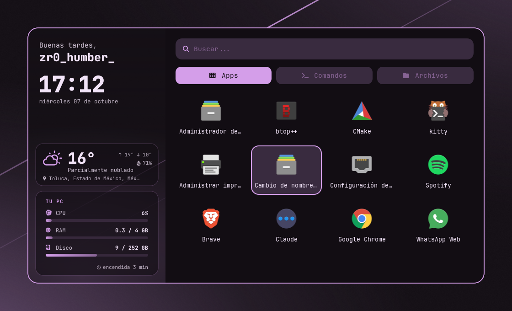
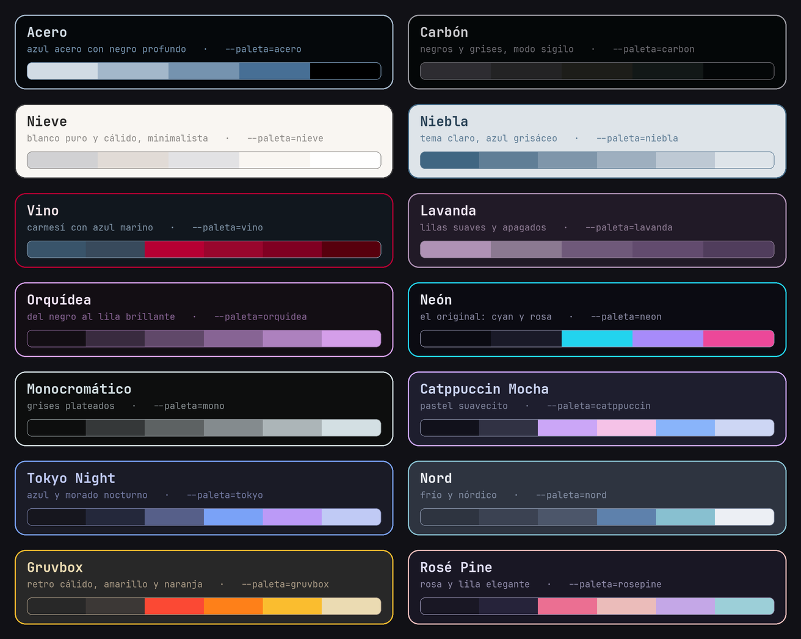
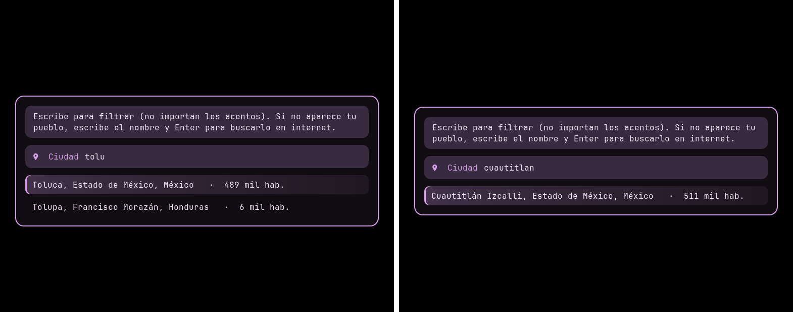

# ZERO — rice para Hyprland

Configuración completa para **Arch Linux + Hyprland** (config en Lua): barra con AGS, lanzador con clima y estadísticas, 14 paletas de colores que cambian todo el escritorio con un atajo, menú de red, capturas de pantalla con vista previa y más.



## Qué trae

- **Look de Hyprland:** bordes con degradado animado, esquinas redondeadas, blur, sombras y animaciones suaves.
- **Barra (AGS v3):** usuario (se pone **blanca cuando eres root**), workspaces 1–5, reloj con calendario, música, red, CPU/RAM/temperatura, volumen, batería, bandeja, paletas, notificaciones y menú de energía. Tiene un guardián que la levanta sola si se cae.
- **Lanzador (Rofi):** panel con saludo según la hora, reloj, **clima de tu ciudad** y estadísticas de tu PC; apps en cuadrícula y pestañas Apps / Comandos / Archivos.
- **14 paletas de colores:** cambian bordes, barra, lanzador, menús, notificaciones, terminal y fondo de pantalla al mismo tiempo. Puedes agregar las tuyas.
- **Clima:** detecta tu ciudad por internet, o la eliges de una lista que se filtra mientras escribes.
- **Menú de red:** Wi-Fi con barras de señal, redes ocultas, cable y configuración avanzada.
- **Capturas de pantalla:** área, pantalla o ventana; notificación con vista previa y botones Abrir / Carpeta / Editar / Borrar.
- **Notificaciones (SwayNC)** y **fondos de pantalla (awww)** con selector de miniaturas.

## Requisitos

- Arch Linux (o derivada con `pacman`).
- **Hyprland con config en Lua** (`hyprland.lua`, versión 0.55 o más nueva). Si todavía tienes `hyprland.conf`, actualiza primero con `sudo pacman -Syu hyprland`.
- Internet durante la instalación.

Todo lo demás lo instala el script: kitty, rofi, swaync, NetworkManager, pipewire, fuentes, íconos, AGS y sus librerías desde el AUR (instala `yay` si no lo tienes), etc.

## Instalación

```bash
git clone https://github.com/TU_USUARIO/zero-rice.git
cd zero-rice
./install.sh
```

El script pregunta antes de cada paso, respalda todo lo que reemplaza en `~/.config/rice-respaldo-<fecha>/` y al final te deja elegir la paleta inicial.

| Opción | Qué hace |
|---|---|
| `./install.sh --si` | Instala todo sin preguntar |
| `./install.sh --solo-configs` | No instala paquetes, solo las configuraciones |
| `./install.sh --paleta=tokyo` | Elige la paleta inicial |
| `./install.sh --actualizar` | Baja lo último del repo y actualiza (conserva tu paleta, tu fondo y tu ciudad) |
| `./install.sh --desinstalar` | Quita el rice (no borra paquetes; todo queda respaldado) |

> Puedes correrlo desde la TTY antes de entrar a Hyprland por primera vez, o desde dentro de Hyprland (se aplica en vivo).

## Atajos

| Atajo | Acción |
|---|---|
| `Super + R` | Lanzador de apps |
| `Super + Shift + P` | Cambiar paleta de colores |
| `Super + Shift + C` | Elegir ciudad del clima |
| `Super + W` | Elegir fondo de pantalla (con miniaturas) |
| `Super + Shift + W` | Fondo aleatorio |
| `Super + N` | Centro de notificaciones |
| `Super + Shift + N` | Menú de red |
| `Super + B` | Reiniciar la barra |
| `Impr Pant` / `Super + Shift + S` | Captura de un área |
| `Shift + Impr Pant` | Captura de pantalla completa |
| `Super + Impr Pant` | Captura de la ventana activa |
| `Super + Shift + Impr Pant` | Captura de pantalla en 5 segundos |

## Paletas



Se cambian con `Super + Shift + P`, con el botón de paleta de la barra o desde la terminal:

```bash
~/.config/hypr/scripts/paleta.sh tokyo       # una en específico
~/.config/hypr/scripts/paleta.sh aleatoria   # sorpresa
~/.config/hypr/scripts/paleta.sh tui         # elegir en la terminal
```

**Agregar tu propia paleta:** abre `~/.config/rice-paletas/paletas.txt`, copia una línea y cambia los colores. El formato viene explicado al principio del archivo. Si el color de fondo es claro, todo el escritorio se vuelve tema claro automáticamente.

Si no quieres que la paleta cambie tu fondo de pantalla o los colores de kitty, edita las primeras líneas de `~/.config/hypr/scripts/paleta.sh` (`CAMBIAR_FONDO=0`, `TEMA_KITTY=0`).

## Clima



- Al instalar, detecta tu ciudad por tu conexión a internet. Es aproximada, por eso dice "(aprox.)".
- Con `Super + Shift + C` eliges tu ciudad de una lista que **se filtra mientras escribes** (sin importar acentos). Las de tu país salen primero, con estado, país y población para no confundirte.
- Si tu pueblo no viene en la lista, escribe el nombre completo y presiona Enter para buscarlo en internet.
- La ciudad que elijas se queda guardada. Para volver a la detección automática: `~/.config/hypr/scripts/clima.sh auto`.
- Ver el clima en la terminal: `~/.config/hypr/scripts/clima.sh ver`.

## Personalizar

- **Tus propios ajustes de Hyprland** (monitores, teclado, más atajos…) van en `~/.config/hypr/mio.lua`. Se carga al final del rice, así que le gana a todo, y **el instalador nunca lo toca**, ni al actualizar. Ejemplo:

  ```lua
  hl.config({ input = { kb_layout = "latam" } })
  hl.bind("SUPER + T", hl.dsp.exec_cmd("thunar"))
  ```

- **Tus fondos de pantalla** van en `~/.config/wallpapers/` (jpg, png, webp, gif). Elígelos con `Super + W`.
- **Carpeta de capturas:** `~/Pictures/Capturas` (o la carpeta de imágenes de tu idioma). Se copian solas al portapapeles.

## Problemas comunes

**La barra no aparece.** Corre `~/.config/hypr/scripts/barra.sh log` para ver el error. Si dice que falta algo de `Astal`, instala `yay -S libastal-meta`.

**Sale una barra roja arriba de la pantalla.** Es un error en la config de Hyprland. Si acabas de editar `mio.lua`, revisa ese archivo.

**El clima dice "no disponible".** Revisa tu internet y elige tu ciudad con `Super + Shift + C`.

**El fondo de pantalla no cambia.** El proyecto `swww` se renombró a `awww`; el instalador instala `awww` desde el AUR, y los scripts usan el que tengas.

## Estructura del repo

```
zero-rice/
├── install.sh                      instalador (instalar / actualizar / desinstalar)
├── config/
│   ├── hypr/rice.lua               look, autoinicio y atajos
│   ├── hypr/scripts/               barra, paleta, clima, panel, lanzador, red, captura, wall
│   ├── ags/                        barra (app.tsx + style.css)
│   ├── rofi/                       lanzador
│   ├── swaync/                     notificaciones
│   └── rice-paletas/paletas.txt    las 14 paletas
└── capturas/                       imágenes de este README
```

Los colores de la barra, Rofi, SwayNC y kitty no están en el repo: los genera `paleta.sh` a partir de la paleta que elijas.

## Créditos

- [Hyprland](https://hypr.land), [AGS / Astal](https://github.com/Aylur/ags), [Rofi](https://github.com/davatorium/rofi), [SwayNotificationCenter](https://github.com/ErikReider/SwayNotificationCenter), [awww](https://github.com/LGFae/swww)
- Clima: [Open-Meteo](https://open-meteo.com) (gratis, sin cuenta)
- Lista de ciudades: [GeoNames](https://www.geonames.org) (licencia CC BY 4.0)
- Ubicación aproximada: [ip-api.com](https://ip-api.com) e [ipinfo.io](https://ipinfo.io)
- Íconos: [Nerd Fonts](https://www.nerdfonts.com) y [Papirus](https://github.com/PapirusDevelopmentTeam/papirus-icon-theme)
- Paletas Catppuccin, Tokyo Night, Nord, Gruvbox y Rosé Pine de sus respectivos proyectos
